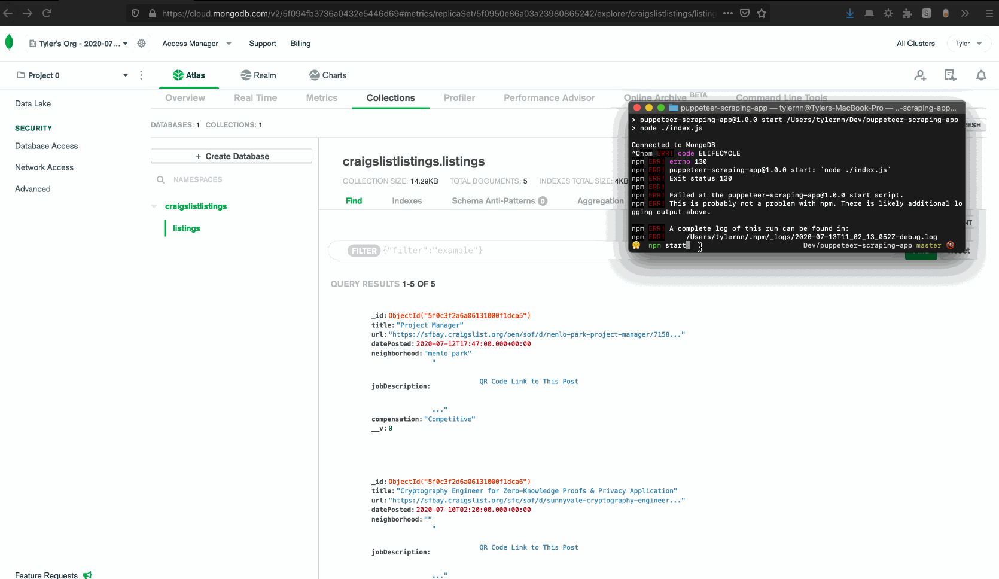

# Craigslist Scraper 

The application will access the website called **Craigslist in San Francisco Bay Area**, look into the list of jobs for **software/qa/dba/etc** and then scrape the `title, date posted, neighborhood, URL, job description and compensation (if available)` of each listing using Cheerio. which is an implementation of jQuery.

The data will then be stored inside a MongoDB database after the program is stopped. I used [MLab](https://mlab.com/) to set up the MongoDB database.

I also implemented some other possible use cases of using Puppeteer in the `examples` directory, such as taking a screenshot of a website or scraping data from a table. I intend to use them as small features in other project(s).

## Instruction

- Simply run `npm install` to install the dependencies.
- `npm start` to start the scraper application
- Or run `node examples/file-name` to execute other examples of using Puppeteer

## Demo

## Dependencies 

- Nodejs 
- [Puppeteer](https://pptr.dev/)
- [Cheerio](https://cheerio.js.org/)
- NoSQL MongoDB
